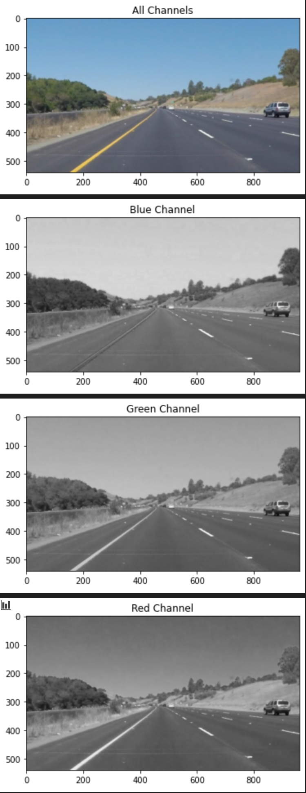
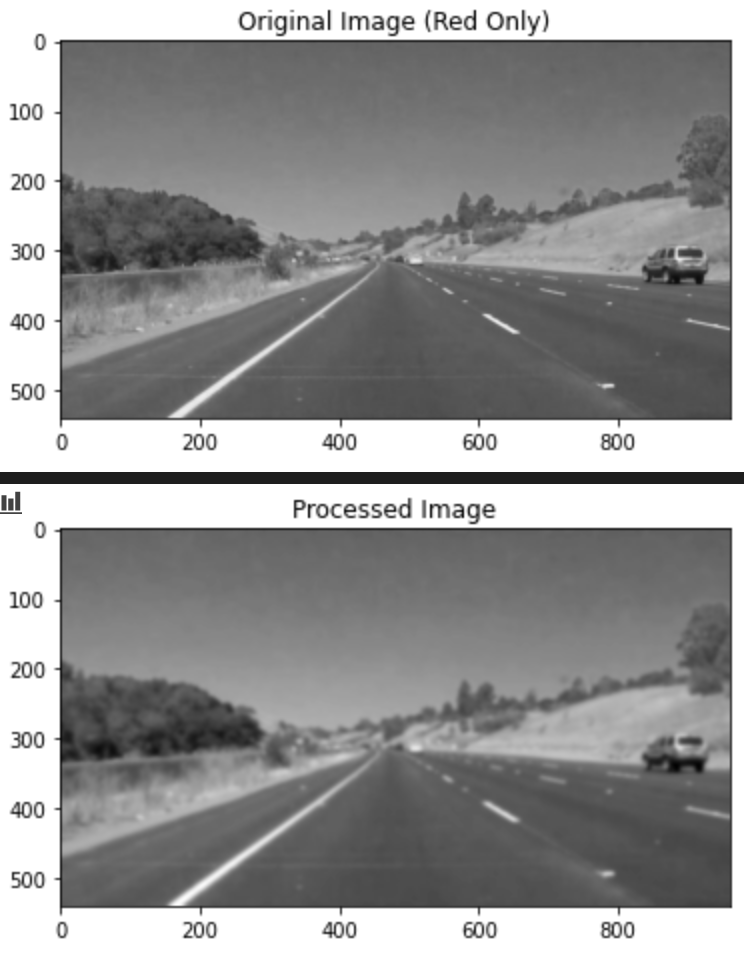
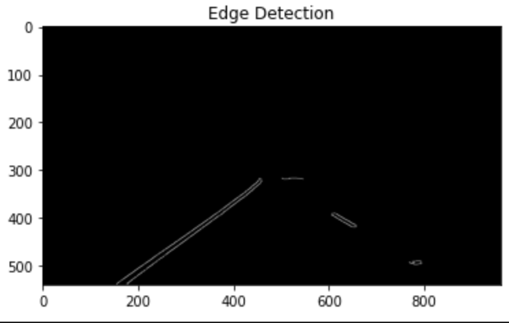
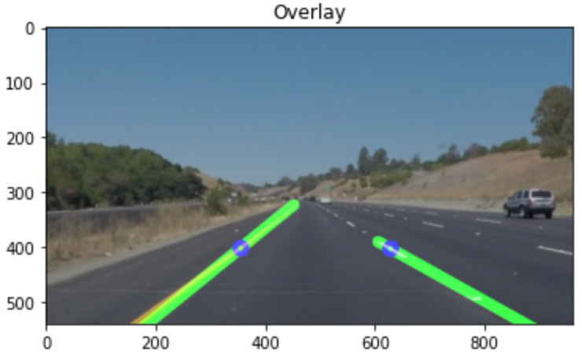

# Finding Lane Lines on a Road
The goal of this project is to be able to read images/videos and annotate lane lines on the road.
---

## Steps
(If the input is a video, firstly the pipeline converts each frame to the BGR color space for use in OpenCV)
1. I split the given image into seperate BGR channels and identified that the red channel best showed both the white and yellow lanes.

2. I isolated the red channel and applied gaussian blur.

3. I then ran the Canny Edge detection algorithm on the processed image and masked the edges to a certain region on the road.

4. I then found all the hough lines in the edge detection image and modified the draw_lines function to identify each lane.

## draw_lines()
The modified draw_lines function starts of by identifying what line segments are part of the left lane marking and the right lane marking. This is done by calculating the slope and stating that all lines with a slope of more than 0 are part of the right, and the lines with a slope of less than 0 are part of the left.

Afterwards, it calculates the average slope and mid-point of both the left and right line segments. It also keeps track of the line segment with the highest y position as that is the top of the lane.

After finding the average mid-point of each lane marking, it uses the slope to calculate the line equation of each lane and uses the line equation to find the x,y coordinates of the lane at the bottom of the image and the highest detected y position of the lane. Afterwards a thick line is drawn between those two points.

---

## Potential Shortcomings
- As the draw_lines function only draws between two points, the pipeline cannot identify curves well.
- As the pipeline focuses on the red channel of each image, red and white objects in the road could be recognized as lanes (e.g a red or white car).

## Potential Improvements
- I could attempt to identify more points in the lane marking, as opposed to just the top and bottom, and proceed to draw lines between all those points for increased accuracy.
- I used OpenCV to read/open images and MatPlotLib to display each image, which proved to be a difficult task as OpenCV uses BGR color space and MatPlotLib uses RGB color space. A simple fix would be to use MatPlotLib to read/open images instead of having to convert between color spaces.